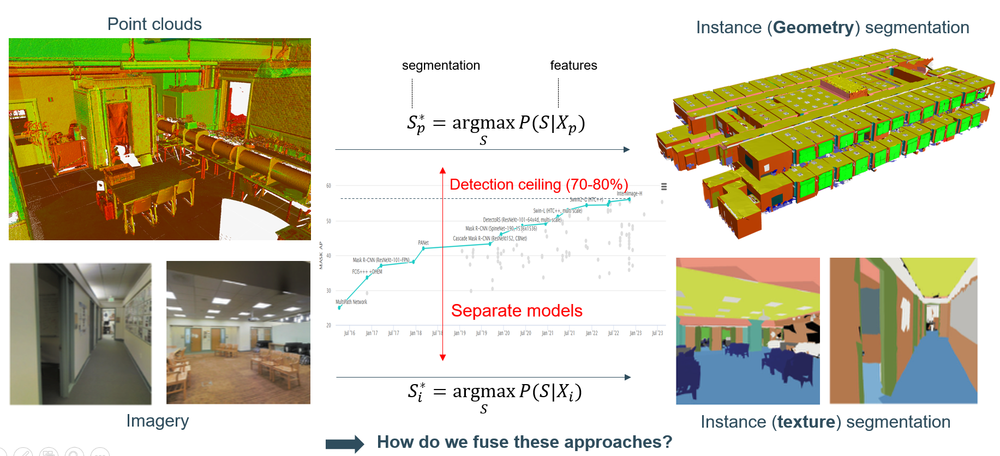
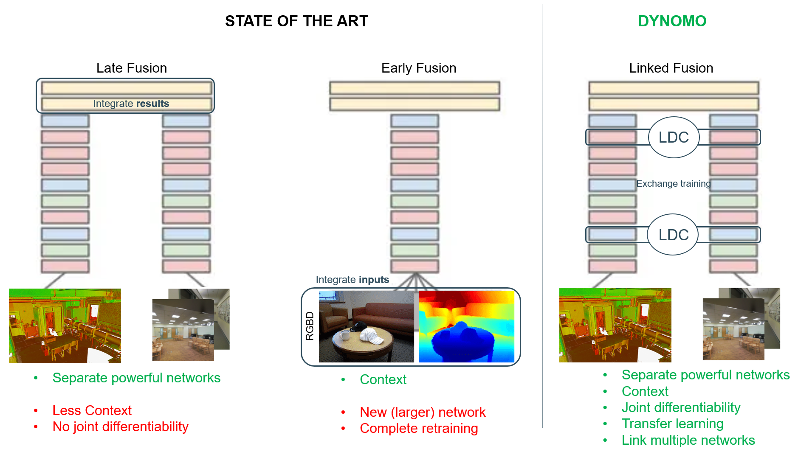
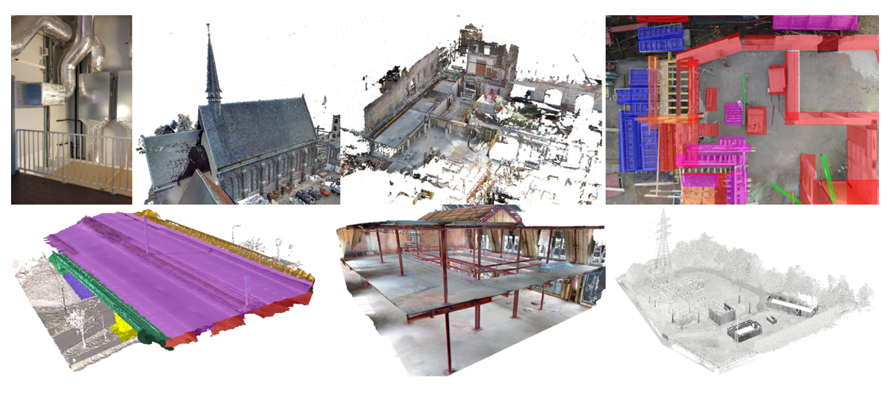

In the context of LinkedFusion, the goal is to extract the smallest building blocks from observations that compose a scene. These building blocks, which may not necessarily be structural elements, represent the minimal segments required for coherent objects. This mathematical problem involves maximizing the conditional probability of a set of segmentations based on feature inputs, such as XYZ coordinates and color information for point clouds, or pixel values for images.

Currently, each modality (point clouds and images) is processed independently, leading to specific interpretation models for each. While this approach is common, it has limitations, especially in domains like construction, where objects vary in texture and geometric features. Achieving market adoption rates of around 90% necessitates combining these approaches, prompting the key question of how to fuse them effectively.

To address the challenges in data fusion, two primary methods are traditionally used: Early and Late Data Fusion techniques. Early fusion involves integrating data at the input layers of Neural Networks (NNs), which requires completely retraining the networks. Late fusion, on the other hand, combines only the final outputs of the networks but lacks joint differentiability. DYNOMO, building on the Principal Investigator's expertise in joint scene interpretation, introduces a new approach called Linked Fusion. This innovative NN architecture connects separate NNs, enabling them to share their intermediate states. This approach not only maintains joint differentiability but also preserves the original trained state of the networks and their efficient parameterization. Linked Fusion holds the promise of significantly lowering training costs compared to existing state-of-the-art fusion methods. Additionally, it offers the flexibility to reuse large, pre-trained architectures, even those from different data modalities.

## DEMONSTRATORS

A key feature of our demonstrators is the integration of various data types, predominantly point clouds and imagery. To ensure a comprehensive analysis, we're not just relying on newly captured data with our advanced sensors. We're also tapping into existing data agreements with prestigious institutions like KU Leuven, FBK, ETH, and collaborating with government agencies and industry leaders. This approach allows us to access a rich pool of information, enhancing the effectiveness of our **two types of demonstrators**.

**Multi-Modal and Multi-Temporal Segmentation**
- Our focus here is on both indoor and outdoor construction environments. The aim is to segment construction and architectural elements using a multi-modal approach. For this, we will utilize over 3 Terabytes of data from benchmark datasets such as S3DIS, ISPRS Indoor Modeling, and MATTERPORT, along with datasets from KU Leuven and FBK. Our methods will incorporate various modalities like Terrestrial and Mobile Laser Scans, Hand-held Imagery, 360 Cameras, and UAV Flights.

**Multi-Temporal Segmentation**
- This segment focuses on time series data from construction sites, bridge inspections, and facility maintenance. We have access to over 5 Terabytes of data from sources like KU Leuven, industry partners, ETH, and the Flemish railway agency. Additionally, we'll utilize the Semantic Kitti and NuScenes sequences for outdoor scene analysis.