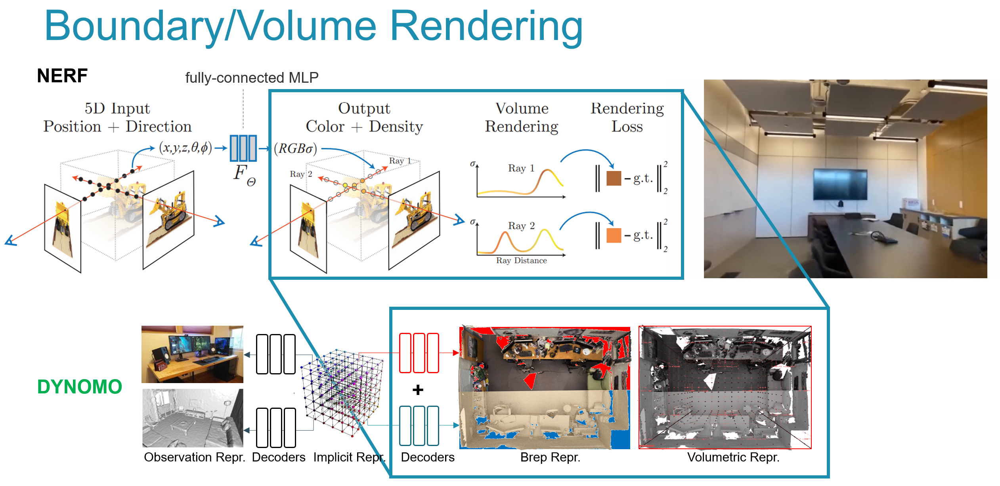
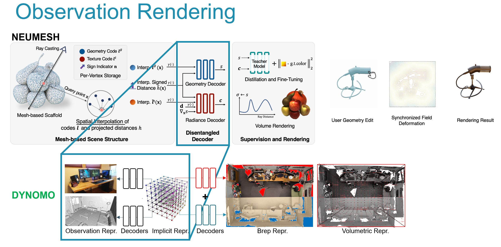
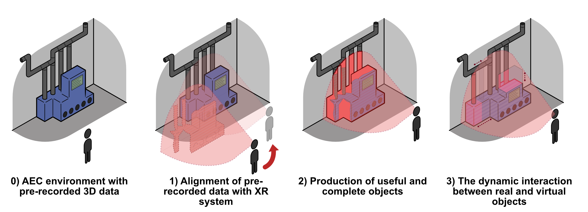

In the current landscape of digital modeling, common behaviors like inpainting, deformations, transformations, and interactions are typically derived from explicitly defined heuristics that are integrated into the design models. DYNOMO, however, proposes a significant shift in this approach by utilizing **Implicit Neural Representations (INRs)**. Through machine learning, these INRs can directly decode such behaviors, offering a more dynamic and intuitive modeling process.

One of the most promising aspects of this approach is the potential compatibility with various design editing tools used in **Building Information Modeling (BIM), Finite Element Model (FEM) meshes, or Geographical Information Systems (GIS)**. The INRs can learn design representations, making them seamlessly compatible with these tools. This is a game-changer, as it not only simplifies the design process but also enhances the adaptability of the models.

Currently, decoders are restricted to a specific implicit representation and are usually trained for a single output type, like image-to-mesh or mesh-to-mesh conversions. **DYNOMO aims to transcend these limitations by generalizing the decoding process for both Boundary and Volumetric representations**. Moreover, it maintains a link to the input observations, enabling dynamic scene representations for the first time.

The implementation of these advanced INRs in DYNOMO marks a significant leap forward in the field of digital modeling. It opens up new possibilities for dynamic, real-time scene representations, revolutionizing how we interact with and manipulate digital models in various domains, including construction, design, and urban planning.

## COMPONENTS
These functionalities, including structural analysis and energy performance, are deeply connected to design representations. Our scientific goals in this work package are:

 - **Boundary Representation Rendering**: This involves creating detailed polygonal mesh and texture representations compatible with Building Information Modeling (BIM) and GIS. Our approach aims to go beyond the current state-of-the-art by directly decoding 3D geometry and textures from the WP3 INR, rather than relying on downscaled 2D renders.

 - **Volumetric Representation Rendering**: This includes discretizing 3D shape information in a way that’s compatible with Constructive Solid Geometry (CSG) and can also be aligned with FEM meshes, leveraging the Principal Investigator’s (PI) previous work.

 - **Observation Rendering**: By integrating initial observations from WP1 with the learned MLPs from WP3, we’ll be able to alter observations based on model changes. Techniques like raymarching and Differentiable Rendering will be employed to work directly on the WP3 MLPs. If necessary, we’ll separate the texture and geometry rendering to ensure compatibility.

 ## DEMONSTRATORS
 DYNOMO's WP3 and WP4 functionalities will be showcased through three types of demonstrators, pivotal for demonstrating the project's valorization potential and fostering industry adoption. These demonstrators, grounded in WP1's close-range observations of realistic test cases, aim to maximize impact by utilizing the Principal Investigator's (PI) extensive industry connections to seek partnerships and potential spin-out funding.

 - **Scene Completion for BIM/GIS**: The emphasis will be on state-of-the-art (SOTA) completion challenges, particularly in environments with movable objects and ongoing operations – areas where DYNOMO technologies can provide significant benefits.

 - **Volumetric Scenes for CSG/FEM**: Volumetric modeling will be applied to engineering tasks such as creating Constructive Solid Geometry (CSG) of Mechanical, Electrical, and Plumbing (MEP) elements and Finite Element Model (FEM) for structural analysis. Though current SOTA analyses are limited to smaller scenes, this demonstrator aims to push these boundaries.

 - **Dynamic Changes for Extended Reality (XR)**: This set of demonstrators will concentrate on scene interactions crucial in Extended and Mixed Reality (XR/MR), gaming, training, and simulation.