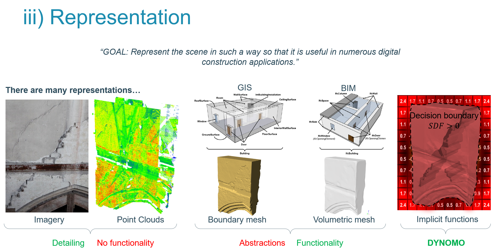
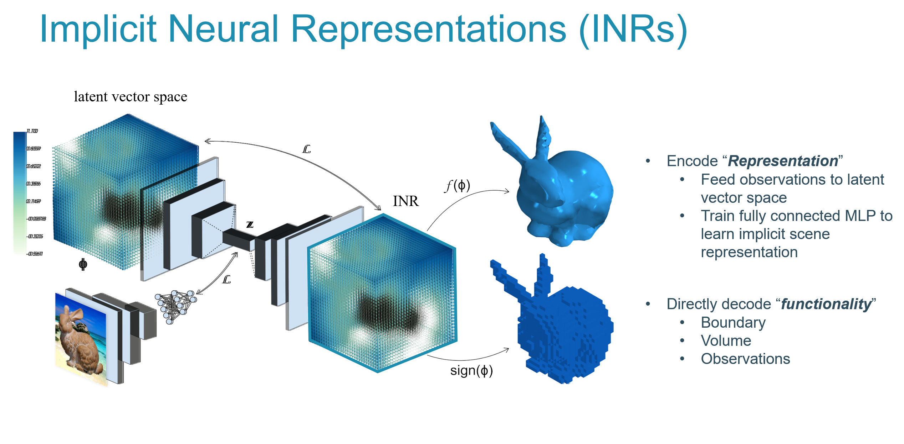
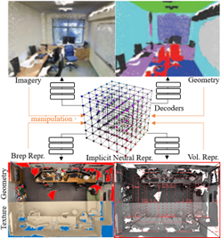

Traditionally, digital construction models have relied on discrete representations, like **Boundary Representation (Brep)** or **Volumetric meshes**. While these methods have been useful, they come with a significant limitation: **finite resolutions**. This often leads to overly simplified, abstract representations that can differ substantially from real-life models. For example, in the realm of Finite Element Models (FEM), such abstractions can result in deformation calculations that are off by as much as 30% compared to more realistic models.

Enter DYNOMO's innovative proposal: the adoption of **Implicit Neural Representations**. This approach represents scenes and components not as a fixed set of points or volumes, but through mathematical formulas. One of the most exciting aspects of Implicit Representations is their ability to be infinitely sampled. This means they have the potential to achieve an unprecedented level of realism in digital modeling, a significant leap forward from current methods.

## COMPONENTS
A significant advantage of our approach is the use of WP2’s Linked Data Cubes to monitor changes in the MLP with new observations. This means that only the newly observed parts need to be remapped, streamlining the process.

DYNOMO will build Linked Data Cubes for close-range observations and methods including:

 - **Spatial Encoding and Geometry Representation**: For geometries, we plan to enhance our approach to using signed distance functions (SDF) for the implicit representation of point cloud data. Our initial strategy involves a direct mapping of geometries and textures using either SDFs or occupancy grids to achieve a comprehensive representation.

 - **Mapping Parameters in Neural Networks**: This includes mapping these parameters onto a densely connected Multilayer Perceptron (MLP) network. This network is designed to represent the color and volume density of the scene. A critical aspect of this phase is the integration of various observation uncertainties – factors like sensor precision, noise, occlusions, varying viewpoints, and misclustering. 

 - **Optimizing the MLP**: Initially, we will target individual components and smaller scenes. Here, the optimization involves reducing the probability estimation of coordinates that are near-certain, such as points observed from multiple sources. Subsequently, we'll expand this approach to larger scenes and components, employing techniques like multi-scale processing to allow the MLP to efficiently iterate through the coordinate space.