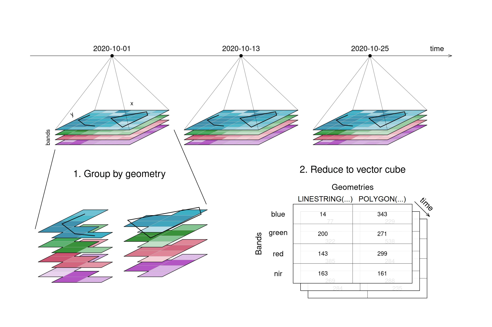
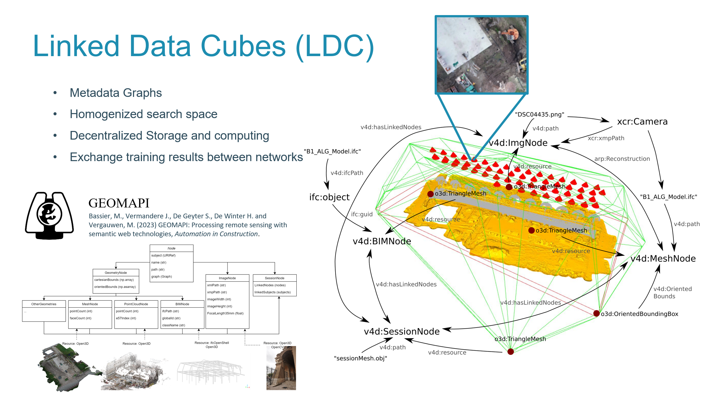
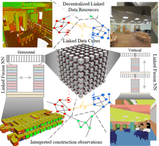

Current Lidar and photogrammetric techniques are generating massive volumes of data - think hundreds of millions of points and tens of thousands of images, plus additional derivative modalities, from just one measurement session. This "**big data**" is not only vast but also extremely diverse, making it tough to manage effectively.

In the field of **Earth Observations, Data Cubes** have been utilized to compress and store data in centralized online repositories, facilitating easier data manipulation. However, this solution falls short in the construction sector where data is mostly proprietary and isolated.

**Linked Data RDF Graphs** can overcome these obstacles by serializing the observations as homogeneous interlinked resources on the semantic web. However, the size of some observations, e.g., a 300-million-point cloud in a single file, does not perform well with the otherwise lightweight RDF Graphs.

**DYNOMO introduces a novel solution: Linked Data Cubes (LDC)**. This innovative approach combines the concepts of Linked Data and Data Cubes. LDC aims to efficiently represent sensory data in decentralized repositories. It even proposes shifting data processing methods closer to the data sources, which could significantly ease issues related to data transfer and privacy. While LDCs have shown great potential in statistical data management, their application in managing construction sensory data is still uncharted territory, opening up exciting avenues for exploration and innovation in this field.

## COMPONENTS

DYNOMO will build Linked Data Cubes for close-range observations and methods including:

 - The **cube storage system**: This system will be an enhancement of current federated information systems and triple stores, tailored to provide the most effective storage solution. Our goal is to preserve the initial observation resources, building a Linked Data Layer on top of them for lightweight resources. 

 - The **data retrieval and manipulation**: This includes capabilities like Roll-up, Drill-down, and Slice. Our approach starts with existing Earth Observation retrieval systems, expanding them to support SPARQL queries for Linked Data resources. A key aspect of this development is the federation of data cube methods to run locally on decentralized resources, enhancing data privacy and reducing data transfer and search space. 

 - The **temporal changes of the observations**: We will concentrate on understanding the temporal changes in observations, such as those obtained through periodic measurements, and their impact on downstream methods. We plan to incorporate the outcomes and changes from WP1, WP3, and WP4 as an additional metadata layer in the Linked Data Cube. This approach allows us to reformulate each task as a conditional probability problem, using previous observations as priors. This same conditioning can also be applied inversely to make predictions about past and future states.